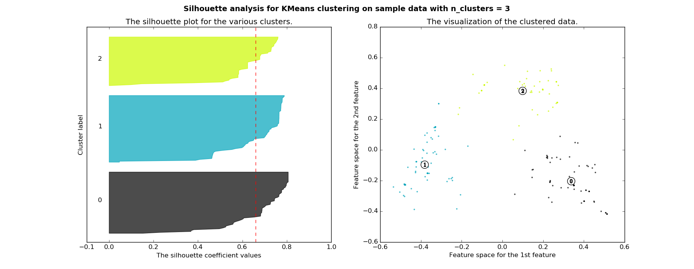

# cuckooml

I am prototyping some ideas for the [the Honeynet Project](https://github.com/hgascon/cuckooml) (Google Summer Of Code 2016). The malware analysis reports from cuckoo sandbox I used are from [here](https://github.com/hgascon/cuckooml).

I tried out 2 strategies:

* **Idea 1** from proposal: Behavioral profile creation based on OS operations - used sections behavior/summary and virustotal from the reports
* **Idea 2** from proposal: Behavioral profile creation based on number of API Calls and using Tf-idf - used section behavior/api from the reports

For clustering, I used KMeans and varied the number of clusters from 2 to 7.

Check out the [images directory](images/os_operations) for the preliminary results on the OS Operations approach and [images directory](images/api_calls) for the API approach.


## Example

An example of the Silhouette Metric applied to KMeans clustering (in 3 clusters) using API calls for feature extraction:



## How to run
Requirementes: python3 scikit-learn, numpy, matlabplotlib

``` 
python3 demo.py --method-type <method_type> --data-dir <data_dir_path>
```
where --method-type can be **api_calls** or **os_operations** (default)
